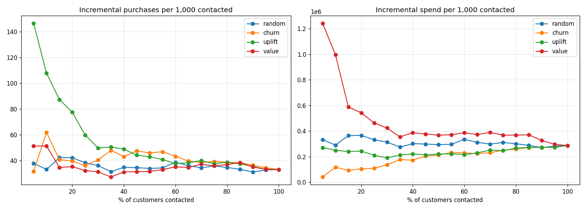
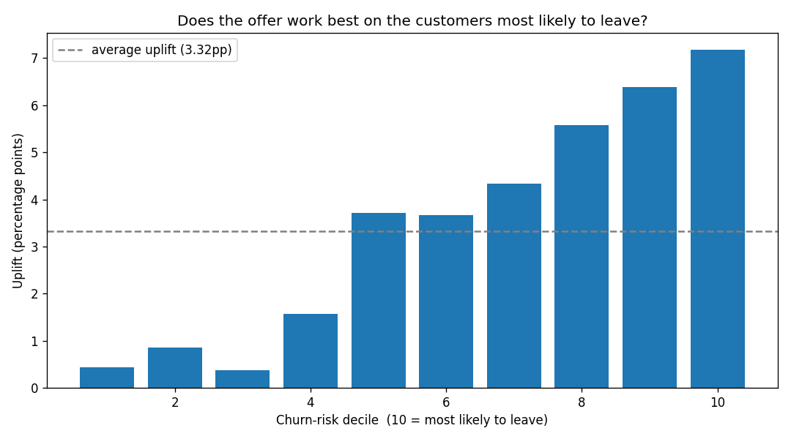
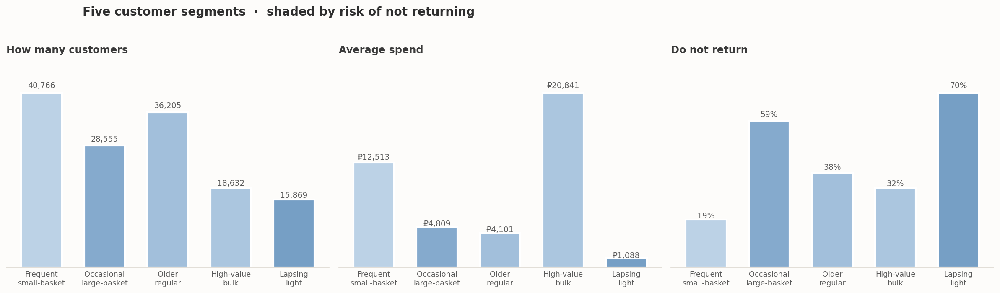
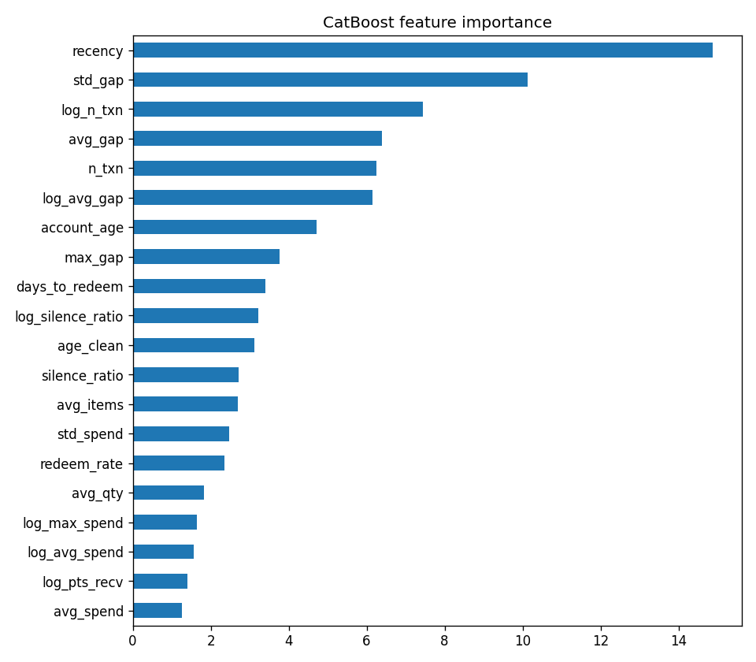

# Churn Without a Cancel Button

Finding customers who quietly stop buying, and working out which ones are worth
spending money on.

**[→ Open the live app](https://retention-targeting.streamlit.app)**  
Set a budget, get a ranked targeting list, and find where the campaign stops
being profitable.

---

## The main finding

**If you count purchases, one answer wins. If you count money, the opposite
answer wins.**

Say you can only afford to message 5% of your customers.

Pick them by "who will respond to a message" and you get **147 extra purchases
per 1,000 people.** Pick them by "who is likely to leave" and you get 32. So
response works nearly 5 times better.

But there is a catch. The people who respond most are the people who spend
least, ₽18,279 average spend in the safest group against ₽2,024 in the
riskiest.

So if you count money instead of purchases, it flips. Picking by response ×
spend gets **₽1.24M per 1,000 people.** Picking by response alone gets ₽0.27M.
Again nearly 5 times, but the other way round.

**Neither "who is leaving" nor "who responds" is enough on its own. You need
"who responds" multiplied by "what they are worth."**



*Left: incremental purchases. Right: incremental revenue. The best policy
changes depending on which one you count.*

---

## The problem

Netflix knows when you leave. You click cancel, and that is recorded.

A grocery shop does not. Customers just stop coming back. Nobody says anything.
Someone who has left and someone simply due for their next trip look identical
in the data.

I read the Q1 2026 filings from DoorDash, Uber and Expedia. None reported a
churn rate for their core marketplace. Ordinary customers do not formally
cancel, so churn has to be inferred rather than observed, and there is no agreed
definition to disclose.

This creates two problems.

**There is no churn label.** You cannot train a model to predict something your
data does not record. And a fixed rule like "90 days inactive" fails
immediately, a weekly shopper silent for a month is at risk, a quarterly
shopper silent for a month is behaving normally.

**You cannot verify that retention spending works.** Customers who accept offers
tend to be the ones who were already engaged. Comparing them to everyone else
measures who signed up, not what the offer did.

---

## What this project does

**1. Uses an observed inactivity outcome instead of a constructed one.** The
campaign included a randomised control group who received nothing. For those
customers, the data records whether they purchased in the following period.
That is a real outcome, not a threshold someone picked.

**2. Groups customers by how they shop**, so the same risk score can be acted on
differently depending on who it belongs to.

**3. Measures what an offer actually changes**, using the randomised campaign to
separate the effect of the message from the effect of who was already buying.

---

## The data

**X5 RetailHero** — a Russian grocery chain. 400,162 loyalty customers, 45.8
million purchase records across 117 days, and a text campaign sent to a random
half of 200,039 customers.

The randomisation is why this dataset was chosen. Without it you cannot tell
whether an offer caused a purchase.

Randomisation was verified rather than assumed: every pre-campaign feature
differs by under 1% between the treated and control groups.

---

## Results

| | Result |
|---|---|
| Effect of the message on everyone | 3.3 extra buyers per 100 |
| Retention model (test PR-AUC) | 0.672 vs 0.572 for a recency-only rule |
| Best uplift model (Qini) | 0.0283 ± 0.0017 vs 0.0220 for churn-risk ranking |
| Purchases, top 5% | 147 vs 32 per 1,000 |
| Revenue, top 5% | ₽1.24M vs ₽0.27M per 1,000 |
| Best net profit | ₽19,127, messaging the top 10% |
| Messaging at random | Loses money at every budget level |

---

## Three things worth reading

**1. The clustering found something the standard method misses.** Two segments
look identical under RFM, the usual retail approach. One shops constantly and
buys a little; the other shops half as often and fills a trolley. Their
non-return rates differ by 12 points.

**2. Two models scored the same using different information.** `recency` ranked
1st in CatBoost and 22nd in logistic regression. Trees build the
recency-to-rhythm interaction internally; a linear model cannot, so an
engineered ratio does real work for one and almost none for the other.

**3. My starting assumption was wrong, and the data explains why.** I expected
the people most likely to leave to respond worst, because many would already be
gone. The opposite happened — response rose steadily with risk.

The reason: nobody in this campaign had been quiet for more than 22 days. X5
only messaged customers who were still shopping, so the "already gone" group
that normally breaks risk-based targeting is absent by construction.

---

### The surprise



*Response rises steadily with churn risk, from 0.4 points in the safest decile
to 7.2 in the riskiest. I expected it to peak in the middle.*

### The five segments



*High-value bulk shoppers spend the most and are among the least likely to
leave. Lapsing light shoppers are the most likely to leave and worth the least.*

### Two models, different features



*CatBoost's most important feature is recency. Logistic regression ranks it
22nd. Both score within 0.005 of each other.*

---

## How it was built

**Layer 1 — Segmentation.** K-means on twelve scaled behavioural features,
compared against Gaussian Mixture across k = 2 to 10, with an RFM quantile
baseline. Selection balanced separation, segment size and interpretability
rather than silhouette alone.

**Layer 2 — Retention.** Nine models compared, from a recency-only rule through
logistic regression, trees, bagged ensembles and three boosting libraries.
Logistic regression selected under a rule stated in advance: within 0.005 of the
leader, three times faster.

**Layer 3 — Uplift.** Four meta-learners compared across five random seeds each,
because a single-seed comparison proved unstable. Evaluated by Qini against two
baselines — random ranking and churn-risk ranking.

Train, validation and test were split three ways. The test set was opened once,
for the selected models only.

---

## What this project cannot tell you

117 days of history, so this measures "did not come back soon," not "gone
forever."

The outcome is binary. We know whether someone bought, not how much they spent.
Every money figure applies their past average basket, which is an assumption.

Contact cost and margin were assumed, not measured. The profit result turns
negative somewhere between ₽5 and ₽20 per message.

The offer is a text message, not a paid membership. A membership costs far more,
so it would need a much larger response to be worth sending.

This is a grocery chain, not a marketplace. There are no sellers, so churn
caused by a favourite seller leaving could not be studied.

Full list in `notebooks/EDA.ipynb`, section 8.

---

## Reproduce

```bash
git clone https://github.com/YOUR-USERNAME/Customer-Retention-Segmentation-Uplift
cd Customer-Retention-Segmentation-Uplift
pip install -r requirements.txt
```

The data downloads automatically via `sklift.datasets.fetch_x5()`.

---

## Built with

pandas · scikit-learn · CatBoost · LightGBM · XGBoost · scikit-uplift
